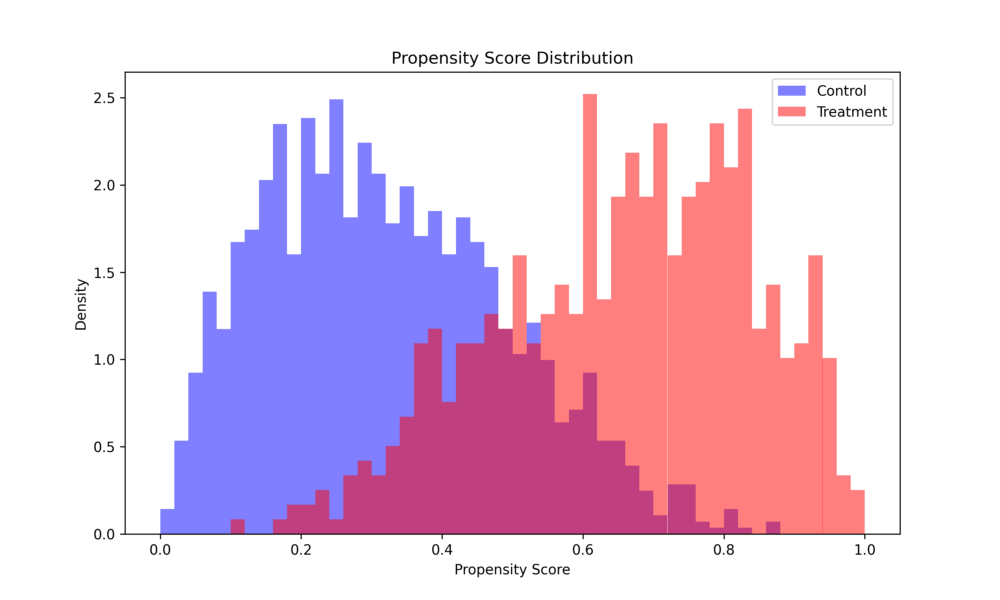

# CausalEstimate

[](https://github.com/kirilklein/CausalEstimate/actions/workflows/unittest.yml)
[](https://github.com/kirilklein/CausalEstimate/actions/workflows/lint.yml)
[](https://github.com/kirilklein/CausalEstimate/actions/workflows/format.yml)
[](https://pypi.org/project/CausalEstimate/)
[](https://pypi.org/project/CausalEstimate/)
[](LICENSE)

---

**CausalEstimate** is a Python library designed for **causal inference**, providing a suite of methods to estimate treatment effects from observational data. It includes doubly robust techniques such as **Targeted Maximum Likelihood Estimation (TMLE)**, alongside **propensity score**-based methods like inverse probability weighting (IPW) and matching. The library is built for **flexibility** and **ease of use**, integrating seamlessly with pandas and supporting **bootstrap**-based standard error estimation and **multiple** estimators in one pass.

---

## Why CausalEstimate?

Libraries like [DoWhy](https://github.com/py-why/dowhy), [EconML](https://github.com/py-why/EconML), and [causallib](https://github.com/BiomedSciAI/causallib) are powerful, but they couple effect estimation to their own model-fitting pipelines. CausalEstimate takes the opposite approach:

- **Bring your own predictions.** You fit propensity scores and outcome models however you like — scikit-learn, XGBoost, a deep model, or scores from an external system. CausalEstimate takes the resulting columns and estimates effects.
- **Pandas-native.** Input is a plain DataFrame with named columns; output is a plain dictionary. No wrappers, no custom data containers.
- **Lightweight.** A small dependency footprint (numpy, pandas, scipy, scikit-learn, statsmodels) and a focused scope: average effects (ATE/ATT/RR) with doubly robust estimators, matching, and bootstrap inference.

Reach for DoWhy/EconML instead when you want end-to-end pipelines, causal graphs, or heterogeneous (CATE) estimation.

---

## Features

- **Causal inference methods** and the effect types each supports:

  | Estimator | ATE | ATT | RR | RRT | ARR |
  |-----------|:---:|:---:|:--:|:---:|:---:|
  | IPW       | ✓   | ✓   | ✓  | ✓   | ✓   |
  | AIPW      | ✓   | ✓   | –  | –   | ✓   |
  | TMLE      | ✓   | ✓   | ✓  | –   | ✓   |
  | Matching  | ✓*  | –   | –  | –   | ✓*  |

  ATE: average treatment effect · ATT: ATE on the treated · RR: risk ratio · RRT: risk ratio on the treated · ARR: absolute risk reduction.
  \* With a caliper, the matched population is strictly neither the full nor the treated population; interpret accordingly.

- **Bootstrap standard error estimation** and confidence intervals
- **Common-support filtering** and **matching** (greedy, optimal)
- **Plotting utilities** for distribution checks (e.g., propensity score overlap)
- **Diagnostics**: positivity/overlap metrics for propensity scores

---

## Installation

```bash
pip install CausalEstimate
```

Or for local development:

```bash
git clone https://github.com/kirilklein/CausalEstimate.git
cd CausalEstimate
pip install -e .
```

---

## Usage

### 1) Single Estimator Usage

You can import any estimator class (e.g., `IPW`, `AIPW`, `TMLE`) and call `compute_effect(df)` directly. Columns (treatment, outcome, propensity score) are passed to the estimator in its constructor.

```python
import numpy as np
import pandas as pd
from CausalEstimate.estimators import IPW

# Simulate data
np.random.seed(42)
n = 1000
ps = np.random.uniform(0, 1, n)          # true propensity for treatment
treatment = np.random.binomial(1, ps)    # actual treatment assignment
outcome = 2 + 0.5 * treatment + np.random.normal(0, 1, n)

df = pd.DataFrame({
    "ps": ps,
    "treatment": treatment,
    "outcome": outcome
})

# Create an IPW Estimator for ATE
ipw_estimator = IPW(
    effect_type="ATE",
    treatment_col="treatment",
    outcome_col="outcome",
    ps_col="ps",
    # optionally stabilized=True if you want stabilized IP weights
)

results = ipw_estimator.compute_effect(df)
print("IPW estimated effect:", results)
```

Output:

```python
{'effect': 0.5518, 'effect_1': 2.5260, 'effect_0': 1.9742}
```

`results` is a plain dictionary: `effect` is the estimated treatment effect, and `effect_1`/`effect_0` are the mean potential outcomes under treatment and control. When bootstrapping is applied (see below), standard errors and confidence intervals are added.

---

### 2) Multi Estimator Usage

If you want to run **multiple** estimators (e.g., IPW, TMLE, AIPW) on the **same** dataset in one pass—optionally applying bootstrap or common-support filtering—you can use the `MultiEstimator`.

```python
from CausalEstimate.estimators import IPW, AIPW, TMLE, MultiEstimator

ipw = IPW(
    effect_type="ATE",
    treatment_col="treatment",
    outcome_col="outcome",
    ps_col="ps"
)
aipw = AIPW(
    effect_type="ATE",
    treatment_col="treatment",
    outcome_col="outcome",
    ps_col="ps",
    probas_t1_col="predicted_outcome_treated",
    probas_t0_col="predicted_outcome_control"
)
tmle = TMLE(
    effect_type="ATE",
    treatment_col="treatment",
    outcome_col="outcome",
    ps_col="ps",
    probas_col="predicted_outcome",
    probas_t1_col="predicted_outcome_treated",
    probas_t0_col="predicted_outcome_control"
)

multi_estimator = MultiEstimator([ipw, aipw, tmle])

# Apply bootstrap (n_bootstraps > 1 triggers bootstrapping), common support, etc.
results = multi_estimator.compute_effects(
    df, 
    n_bootstraps=50,  # If n_bootstraps > 1, bootstrapping is applied.
    apply_common_support=True,
    common_support_threshold=0.05,
    return_bootstrap_samples=True  # Optionally return raw bootstrap estimates.
)
print(results)
```

Here, `results` is a dictionary with keys corresponding to each estimator's class name (e.g., `"IPW"`, `"AIPW"`, `"TMLE"`). For estimators that perform bootstrapping (i.e. when n_bootstraps > 1), the output dictionary includes:

- `"effect"`: The mean effect across bootstrap samples.
- `"std_err"`: The standard deviation of the bootstrap estimates.
- `"CI95_lower"` and `"CI95_upper"`: The 95% confidence interval computed using the percentile method.
- `"n_bootstraps"`: The number of bootstrap samples (e.g., 50).
- Optionally, if `return_bootstrap_samples=True`, a `"bootstrap_samples"` key with the raw bootstrap estimates (e.g., for the overall effect, treated, and untreated effects).

When no bootstrapping is performed (i.e. n_bootstraps is set to 1), `"n_bootstraps"` is set to 0 and the bootstrap summary keys (like `"std_err"`, `"CI95_lower"`, `"CI95_upper"`) may not be present.
---

### 3) Matching

The library supports both **optimal** and **greedy** (a.k.a. eager) matching. For example:

```python
import pandas as pd
import numpy as np
from CausalEstimate.matching import match_optimal, match_eager

df = pd.DataFrame({
    "PID": [101, 102, 103, 202, 203, 204],
    "treatment": [1, 1, 1, 0, 0, 0],
    "ps": [0.30, 0.35, 0.90, 0.31, 0.34, 0.85],
})

# Optimal matching (with caliper=0.05, 1 control per treated)
matched_optimal = match_optimal(
    df, n_controls=1, caliper=0.05,
    treatment_col="treatment", ps_col="ps", pid_col="PID"
)
print("Optimal Matching Results:")
print(matched_optimal)

# Eager (greedy) matching
matched_eager = match_eager(
    df, caliper=0.05,
    treatment_col="treatment", ps_col="ps", pid_col="PID"
)
print("Eager Matching Results:")
print(matched_eager)
```

Both functions return a DataFrame of matched pairs (or sets), typically with columns like `[treated_pid, control_pid, distance]`.

---

### 4) Plotting

CausalEstimate provides basic **plotting utilities** to **visualize** distributions of propensity scores or predicted outcome probabilities across treatment vs. control.

#### **Example: Propensity Score Distribution**

📌 **Generated from** [this notebook](examples/plot_examples.ipynb)



```python
import matplotlib.pyplot as plt
from CausalEstimate.vis.plotting import plot_propensity_score_dist, plot_outcome_proba_dist

# Suppose df has columns "ps", "treatment", and "predicted_outcome"
fig, ax = plot_propensity_score_dist(df, ps_col="ps", treatment_col="treatment")
plt.show()

fig, ax = plot_outcome_proba_dist(df, outcome_proba_col="predicted_outcome", treatment_col="treatment")
plt.show()
```

### 5) Diagnostics

Positivity/overlap diagnostics to report alongside IPW/TMLE estimates:

```python
from CausalEstimate.diagnostics import compute_positivity_metrics

# Suppose df has columns "ps" and "treatment"
metrics = compute_positivity_metrics(df, ps_col="ps", treatment_col="treatment")
print(metrics["prop_ps_extreme"])          # share of PS outside [eps, 1 - eps]
print(metrics["common_support_low"], metrics["common_support_high"])  # trimmed common support
print(metrics["flag_extreme_ps"])
```

Weight diagnostics — effective sample size (Kish) and weight summaries for the
IPW weights the estimators use:

```python
from CausalEstimate.diagnostics import compute_ess, compute_weight_diagnostics

diag = compute_weight_diagnostics(df, ps_col="ps", treatment_col="treatment", weight_type="ATE")
print(diag["ess_total"], diag["ess_fraction_total"])   # ESS and ESS / n
print(diag["max_weight"], diag["weight_q99"])

# Or on your own weights (e.g. externally computed):
ess = compute_ess(weights)
```

---

## Development

See [CONTRIBUTING.md](CONTRIBUTING.md) for details on setting up a dev environment, running tests, and contributing to this project.

---

## License

**CausalEstimate** is licensed under the MIT License. See [LICENSE](LICENSE) for more details.

---

## Contact

- **GitHub**: [kirilklein](https://github.com/kirilklein)
- **Email**: [kikl@di.ku.dk](mailto:kikl@di.ku.dk)

Please open issues or pull requests if you find any bugs or want to propose enhancements.

---

## Citation

If you use **CausalEstimate** in your research, please cite it via the "Cite this repository" button on GitHub (backed by [CITATION.cff](CITATION.cff)), or use the following BibTeX entry:

```bibtex
@software{causalestimate,
  author = {Klein, Kiril},
  title = {CausalEstimate: A Python Library for Causal Inference},
  year = {2024},
  url = {https://github.com/kirilklein/CausalEstimate},
  note = {GitHub repository}
}
```
