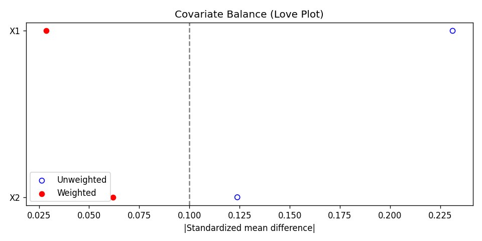

<p align="center">
  <picture>
    <source media="(prefers-color-scheme: dark)" srcset="docs/assets/logo-dark.png">
    
  </picture>
</p>

[](https://github.com/kirilklein/CausalEstimate/actions/workflows/unittest.yml)
[](https://github.com/kirilklein/CausalEstimate/actions/workflows/lint.yml)
[](https://github.com/kirilklein/CausalEstimate/actions/workflows/format.yml)
[](https://pypi.org/project/CausalEstimate/)
[](https://pypi.org/project/CausalEstimate/)
[](LICENSE)
[](https://kirilklein.github.io/CausalEstimate/)
[](https://deepwiki.com/kirilklein/CausalEstimate)

📖 **Documentation**: [kirilklein.github.io/CausalEstimate](https://kirilklein.github.io/CausalEstimate/)

CausalEstimate estimates causal effects from observational data using TMLE, AIPW, inverse probability weighting, and matching. Provide the propensity scores and outcome predictions from your own models as columns in a pandas DataFrame.

---

## Why CausalEstimate?

Many causal-inference libraries combine model fitting and effect estimation. CausalEstimate keeps the two separate:

- **Bring your own predictions.** Fit propensity and outcome models with scikit-learn, XGBoost, a deep model, or an external system. CausalEstimate uses the resulting columns to estimate effects.
- **Pandas-native.** Pass a DataFrame with named columns and get back a plain dictionary.
- **Focused.** Estimate ATE, ATT, and risk ratios. TMLE includes influence-curve standard errors, and every estimator supports bootstrap confidence intervals. Built-in diagnostics help assess overlap, covariate balance, and weights.

Choose [DoWhy](https://github.com/py-why/dowhy) or [EconML](https://github.com/py-why/EconML) instead if you need an end-to-end modeling pipeline, causal-graph construction, or heterogeneous treatment effects.

---

## Installation

```bash
pip install CausalEstimate
```

---

## Quickstart

### Single estimator

Each estimator is configured with its column names and effect type, then called with `compute_effect(df)`.

```python
from CausalEstimate.datasets import load_binary_with_probas
from CausalEstimate.estimators import IPW

# Synthetic data with known ground truth. Columns "ps", "probas",
# "probas_t0", "probas_t1" stand in for your own model's predictions.
df, params = load_binary_with_probas(
    n_samples=5000,
    random_state=42,
    return_params=True,
)

ipw = IPW(
    effect_type="ATE",
    treatment_col="treatment",
    outcome_col="Y",
    ps_col="ps",
)
results = ipw.compute_effect(df)

print(f"IPW estimated effect: {results['effect']:.4f}")
print(f"True ATE: {params['true_ate']:.4f}")
```

```
IPW estimated effect: 0.1599
True ATE: 0.1644
```

`results["effect"]` is the estimated effect. `effect_1` and `effect_0` are the mean potential outcomes under treatment and control.

To compare several estimators or add bootstrap confidence intervals, see [Multiple Estimators & Bootstrap](https://kirilklein.github.io/CausalEstimate/user-guide/multi-estimator/).

---

## What's included

| Estimator | ATE | ATT | RR | RRT | ARR |
|-----------|:---:|:---:|:--:|:---:|:---:|
| IPW       | ✓   | ✓   | ✓  | ✓   | ✓   |
| AIPW      | ✓   | ✓   | –  | –   | ✓   |
| TMLE      | ✓   | ✓   | ✓  | –   | ✓   |
| Matching  | ✓*  | –   | –  | –   | ✓*  |

ATE is the average treatment effect, and ATT is the average treatment effect among treated units. RR is the risk ratio, RRT is the risk ratio among treated units, and ARR is the absolute risk reduction.
\* With a caliper, the matched population is neither the full nor the treated population; interpret accordingly.

- **Diagnostics** (`CausalEstimate.diagnostics`): covariate balance, positivity and overlap metrics, effective sample size, and weight summaries.
- **Common-support filtering** (`CausalEstimate.filter_common_support`): trim to the propensity-score overlap region.
- **Matching** (`CausalEstimate.estimators.Matching`): greedy and optimal propensity-score matching with an optional caliper.
- **Synthetic datasets** (`CausalEstimate.datasets`): `load_binary` and `load_binary_with_probas` can return known effects for benchmarking.
- **Plotting** (`CausalEstimate.vis`): propensity-score and outcome-probability distributions by treatment group.

Run all diagnostics in one call before reporting IPW or TMLE estimates:

```python
from CausalEstimate import run_diagnostics

report = run_diagnostics(
    df,
    ps_col="ps",
    treatment_col="treatment",
    covariate_cols=["X1", "X2"],
)
print(report["flags"])  # {"extreme_ps": bool, "unbalanced": bool}
print(report["positivity"], report["weights"], report["balance_summary"])
```

---

## Documentation

- [Getting Started](https://kirilklein.github.io/CausalEstimate/getting-started/) — installation and the input-data contract
- [Estimators](https://kirilklein.github.io/CausalEstimate/user-guide/estimators/) — IPW, AIPW, TMLE, Matching
- [Multiple Estimators & Bootstrap](https://kirilklein.github.io/CausalEstimate/user-guide/multi-estimator/) — compare estimators and add bootstrap confidence intervals
- [Matching](https://kirilklein.github.io/CausalEstimate/user-guide/matching/) — greedy and optimal propensity-score matching
- [Diagnostics](https://kirilklein.github.io/CausalEstimate/user-guide/diagnostics/) — overlap, weights, covariate balance, and the combined report
- [Plotting](https://kirilklein.github.io/CausalEstimate/user-guide/plotting/) — propensity-score and outcome-probability distributions
- [API Reference](https://kirilklein.github.io/CausalEstimate/api/estimators/) — full signatures and docstrings

Balance before/after weighting at a glance ([notebook](examples/diagnostics_example.ipynb)):



---

## Contributing

See [CONTRIBUTING.md](CONTRIBUTING.md) for the dev setup and test workflow. Bug reports and feature requests are welcome as [issues](https://github.com/kirilklein/CausalEstimate/issues); questions can also go to [kikl@di.ku.dk](mailto:kikl@di.ku.dk).

## License

MIT — see [LICENSE](LICENSE).

## Citation

Use the "Cite this repository" button on GitHub (backed by [CITATION.cff](CITATION.cff)), or:

```bibtex
@software{causalestimate,
  author = {Klein, Kiril},
  title = {CausalEstimate: A Python Library for Causal Inference},
  year = {2024},
  url = {https://github.com/kirilklein/CausalEstimate},
  note = {GitHub repository}
}
```
